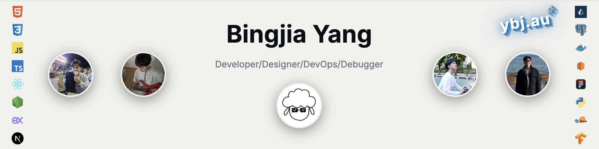

  <picture>
    <source
      media="(prefers-color-scheme: dark)"
      srcset="./linkedin-banner.png"
    />
    <source
      media="(prefers-color-scheme: light)"
      srcset="./linkedin-banner-light.png"
    />
    
  </picture>

  <picture>
    <source
      media="(prefers-color-scheme: dark)"
      srcset="https://raw.githubusercontent.com/YBJ0000/github-breakout/github-breakout/images/breakout-dark.svg"
    />
    <source
      media="(prefers-color-scheme: light)"
      srcset="https://raw.githubusercontent.com/YBJ0000/github-breakout/github-breakout/images/breakout-light.svg"
    />
    
  </picture>

---

### Personal Projects

**[Personal Site](https://ybj.au/)**  
Portfolio & CMS blog  
    

**[Cloud-Native Blog](https://full-stack-mini-blog.vercel.app/)**  
Dockerized backend with Redis caching, deployed on AWS  
      

**[ThreadTalk](https://ybj-threadtalk.vercel.app/)**  
Reddit-like forum with 3D effects  
  

**[World Clock](https://world-clock-ybj.vercel.app/)**  
Modern clock with weather  
 

**[3D Monkey Viewer](https://hungrymonkey.netlify.app/)**  
Mobile 3D model viewer  
 

**[3D Guitar Viewer](https://threejs-guitar-demo.vercel.app/)**  
Mobile 3D model viewer  

---

### Capstone Project

**[Automated Booking System](https://github.com/unsw-cse-comp99-3900/capstone-project-25t2-9900-w09b-donut)**  
Full-stack CRM system for Museum of Human Disease with dual interfaces: user booking portal and comprehensive admin management system (Private)  
              
