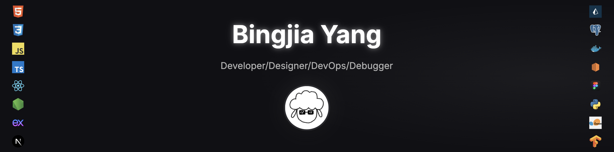

  

<h1 align="center">

</h1>

  <a href="mailto:yangbingjia1206@gmail.com">📧 yangbingjia1206@gmail.com</a> •
  <a href="https://au.linkedin.com/in/bingjia-yang-63111b290" target="_blank">LinkedIn</a> •
  <a href="https://ybj.au" target="_blank">Portfolio</a>

---

### 🧑‍💻 About Me

Versatile Full Stack Developer with DevOps proficiency, experienced in building and deploying scalable web applications using React, Node.js and Next.js. Skilled in modern development workflows with Docker, CI/CD pipelines, and cloud platforms such as AWS EC2. Delivered multiple demo apps and real-world systems with strong problem-solving and communication skills in cross-functional teams.

---

### 🧠 Tech Stack

  
  
  
  
  
  
  
  
   <!-- Prisma -->
  
  
   <!-- AWS EC2 -->
  
  
  
  
  

---

### 🌐 GitHub Stats

  
  &nbsp;&nbsp;
  

---

### 🔥 Personal Projects

#### 🧑‍💼📁📝 [Personal Site (with Portfolio & Blog)](https://ybj.au/)

A full-featured personal portfolio and CMS blog.  
Tech: Next.js, Sanity, Clerk, Resend, Upstash, Neon, Better Stack, Vanta.js  

#### ☁️📝⚙️ [Cloud-Native Mini Blog](https://full-stack-mini-blog.vercel.app/)

A lightweight cloud-native blog with Dockerized backend, Redis caching, and CI/CD automation.   
Tech: React, Node.js, Docker, AWS EC2, Nginx, Prisma, PostgreSQL (Neon), Redis, GitHub Actions

#### ✨🗣️💬 [ThreadTalk](https://ybj-threadtalk.vercel.app/)

An Reddit-like forum with 3D particle effects and thread management.  
Tech: HTML, CSS, Vanilla JS, Node.js, Express.js, JWT, Three.js  

#### 🌍⏰🌤️ [World Clock](https://world-clock-ybj.vercel.app/)

A modern clock app with dynamic theming and weather.  
Tech: React, Tailwind CSS, Axios, OpenWeather API  

#### 🎮🐵📷 [3D Monkey Viewer](https://hungrymonkey.netlify.app/)

Mobile-friendly 3D model viewer using Three.js.  
Tech: Rodin, Three.js

#### 🎮🎸📸 [3D Guitar Viewer](https://threejs-guitar-demo.vercel.app/)

Mobile-friendly 3D model viewer using Three.js.  
Tech: Sketchfab, Three.js

---

### 🔥 Capstone Project

Automated Booking System for Museum of Human Disease (Private).

Tech: 
- Frontend: React, Material UI, FullCalendar
- Backend: Node.js, Express.js
- Database: PostgreSQL (Neon)
- Container: Docker (required by uni)
- ORM: Prisma (to simplify and record database operation)
- Reverse Proxy: Nginx (to forward request)
- Testing: Postman, Vitest, Jest, Chrome Devtools, ESlint
- Email Service: Resend (to send verification code)
- Charts Library: Recharts