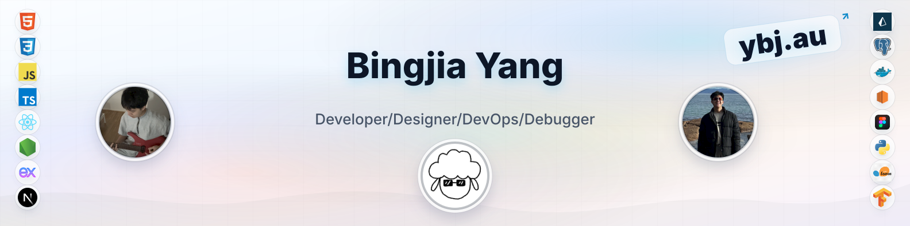

  <picture>
    <source
      media="(prefers-color-scheme: dark)"
      srcset="./linkedin-banner.svg"
    />
    <source
      media="(prefers-color-scheme: light)"
      srcset="./linkedin-banner-light.svg"
    />
    
  </picture>

  <picture>
    <source
      media="(prefers-color-scheme: dark)"
      srcset="https://raw.githubusercontent.com/YBJ0000/github-breakout/github-breakout/images/breakout-dark.svg"
    />
    <source
      media="(prefers-color-scheme: light)"
      srcset="https://raw.githubusercontent.com/YBJ0000/github-breakout/github-breakout/images/breakout-light.svg"
    />
    
  </picture>

